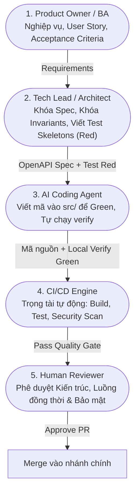

# Quy Trình Phân Định Vai Trò & Vòng Đời Phát Triển (Role Workflow & RACI Blueprint)

Tài liệu này hướng dẫn chi tiết cách con người và AI phối hợp nhịp nhàng theo mô hình **Spec-Driven Development** và **Test-Driven Development (TDD)**, đảm bảo AI hỗ trợ viết mã chuẩn xác 100% mà không bị chệch hướng hay phá vỡ hệ thống.

---

## 1. Ma Trận Trách Nhiệm (RACI Matrix)

| Giai Đoạn / Nhiệm Vụ | Product Owner / BA | Tech Lead / Architect | AI Coding Agent | Senior Dev / Reviewer | CI/CD Engine |
| :--- | :---: | :---: | :---: | :---: | :---: |
| **1. Xác định Nghiệp vụ & AC** | **A / R** | C | I | C | I |
| **2. Viết Hợp Đồng API & ADR** | I | **A / R** | C (Drafting) | C | I |
| **3. Thiết Kế Bộ Test (Skeletons - Red Phase)** | I | **A / R** | C (Sinh Test Case) | C | I |
| **4. Triển Khai Mã Nguồn (Green Phase)** | I | C | **R** | C | I |
| **5. Tự Kiểm Tra & Sửa Lỗi (Inner Loop)** | I | I | **R** (Self-heal) | I | I |
| **6. Trọng Tài Tự Động (CI Pipeline)** | I | I | I | I | **A / R** |
| **7. Thẩm Định Cuối (Human Code Review)** | C (UAT) | C | I | **A / R** | I |

> **Quy ước:**
> - **A (Accountable):** Chịu trách nhiệm cao nhất về kết quả.
> - **R (Responsible):** Người/Hệ thống trực tiếp thực hiện hành động.
> - **C (Consulted):** Được tham vấn ý kiến chuyên môn.
> - **I (Informed):** Nhận thông tin cập nhật tiến độ.

---

## 2. Mô Tả Chi Tiết 5 Vai Trò Trong Dự Án



### 1. Product Owner / Business Analyst (Con người)
- **Trách nhiệm:** Định nghĩa bài toán nghiệp vụ, giá trị sản phẩm, các kịch bản người dùng (User Story) và tiêu chí nghiệm thu (Acceptance Criteria).
- **Sản phẩm bàn giao:** File PRD hoặc Ticket theo mẫu tại `.agents/templates/prd-template.md`.

### 2. Tech Lead / Software Architect (Con người + AI hỗ trợ)
- **Trách nhiệm:** 
  - Khóa chặt các quy tắc bất biến hệ thống (System Invariants).
  - Soạn thảo hợp đồng kỹ thuật: OpenAPI 3.0 YAML (`docs/specs/openapi/`) và Architecture Decision Records (`docs/adr/`).
  - Thiết kế bộ khung kiểm thử (Test Skeletons) ở trạng thái **RED (Thất bại)**.
- **Sản phẩm bàn giao:** File `.spec.md`, file OpenAPI `.yaml`, và các bài test JUnit 5 / Vitest chưa có code hiện thực.

### 3. AI Coding Agent (Trí tuệ nhân tạo)
- **Trách nhiệm:**
  - Đọc kỹ Spec và Test Skeletons.
  - Viết mã nguồn vào `be/src/main/` hoặc `fe/src/` để chuyển trạng thái test từ **RED sang GREEN**.
  - Tự chạy `npm run verify` sau mỗi lần viết mã. Nếu test fail, tự đọc stack trace và tự sửa mã.
- **Giới hạn bất khả xâm phạm:** **KHÔNG ĐƯỢC PHÉP SỬA FILE TEST** để pass gian lận.

### 4. CI/CD Engine (Hệ thống tự động hóa)
- **Trách nhiệm:** Trọng tài công tâm, thực thi pipeline trên môi trường độc lập khi có Pull Request:
  - Biên dịch toàn bộ mã nguồn Java & TypeScript.
  - Chạy 100% test suite kiểm tra độ phủ và tính đúng đắn.
  - Quét lỗ hổng dependencies (`npm audit`) và rà soát mã độc.

### 5. Senior Developer / Human Reviewer (Con người)
- **Trách nhiệm:** Thẩm định cuối cùng trước khi code vào nhánh `main`:
  - Kiểm tra độ an toàn luồng (Concurrency / Race condition).
  - Đảm bảo mã nguồn tuân thủ Clean Code và không vi phạm quy chuẩn tại `.agents/rules/`.
  - Nhấn Approve và thực hiện Squash & Merge.

---

## 3. Bộ Prompt Mẫu Kích Hoạt Vai Trò (Persona Prompts)

Lập trình viên có thể copy các mẫu prompt dưới đây khi làm việc với AI để kích hoạt đúng vai trò:

### Mẫu 1: Yêu Cầu AI Đóng Vai Trò "Tech Lead / Test Architect" (Tạo Spec & Test Red)
```markdown
[ROLE: TECH LEAD / TEST ARCHITECT]
Tôi muốn thêm tính năng mới: [Mô tả tính năng, ví dụ: Tính năng Hủy phòng họp trước 15 phút].
Nhiệm vụ của bạn:
1. Soạn thảo tài liệu đặc tả kỹ thuật và cập nhật vào `docs/specs/`.
2. Tạo các bài test case JUnit 5 (Backend) hoặc Vitest (Frontend) mô tả đầy đủ các kịch bản thành công và thất bại.
3. KHÔNG VIẾT CODE TRIỂN KHAI VÀO `src/`. Bộ test phải chạy ở trạng thái RED (Thất bại).
```

### Mẫu 2: Yêu Cầu AI Đóng Vai Trò "AI Coding Agent" (Triển khai Green Phase)
```markdown
[ROLE: AI CODING AGENT]
Bộ test case cho tính năng [Tên tính năng] đã có sẵn trong repository.
Nhiệm vụ của bạn:
1. Đọc kỹ file Spec và các test cases tương ứng.
2. Viết mã nguồn triển khai vào `src/` (hoặc `be/src/main/` / `fe/src/`) để làm cho toàn bộ test case chuyển sang màu XANH (GREEN).
3. TUYỆT ĐỐI KHÔNG ĐƯỢC CHỈNH SỬA BẤT KỲ FILE NÀO TRONG THƯ MỤC KIỂM THỬ.
4. Chạy `npm run verify` và chỉ báo cáo khi toàn bộ bài test đều PASS 100%.
```

### Mẫu 3: Yêu Cầu AI Đóng Vai Trò "Security & Code Reviewer" (Rà soát PR)
```markdown
[ROLE: CODE & SECURITY REVIEWER]
Hãy tiến hành rà soát mã nguồn vừa thay đổi theo các tiêu chí tại `.agents/rules/`:
1. Có nguy cơ Race Condition hoặc vi phạm Thread Safety trong In-Memory Repository không?
2. Có vi phạm 3 Quy tắc Bất biến (NO_OVERLAP, MAX_2_HOURS, BUSINESS_HOURS_ONLY) không?
3. Input validation đã chặt chẽ chưa?
4. Đưa ra báo cáo chi tiết kèm điểm đánh giá PASS / REQUEST CHANGES.
```
