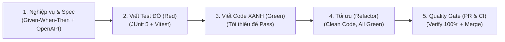

# QUY TRÌNH PHÁT TRIỂN TÍNH NĂNG MỚI (STANDARD TASK WORKFLOW)

Tài liệu này là cẩm nang hướng dẫn chuẩn mực (SOP) dành cho Lập trình viên và AI Coding Agent khi tiếp nhận và triển khai bất kỳ một nhiệm vụ (Task / Feature / Bugfix) mới nào trong hệ thống **RoomSync**.

---

## 🧭 Tổng Quan Chu Trình 5 Bước



---

## BƯỚC 1: Phân Tích Nghiệp Vụ & Khóa Hợp Đồng API (Spec Phase)

Mỗi tính năng mới bắt buộc phải có hợp đồng giao tiếp rõ ràng trước khi viết dòng code đầu tiên.

1. **Khởi tạo nhánh Git:**
   ```bash
   git checkout main
   git pull origin main
   git checkout -b feat/<ten-tinh-nang>
   # Ví dụ: git checkout -b feat/cancel-booking
   ```

2. **Soạn thảo Kịch bản Nghiệp vụ (BDD):**
   - Viết các kịch bản hành vi theo định dạng **Given - When - Then** vào `docs/specs/` (hoặc tạo file mới `docs/specs/<feature>.spec.md`).
   - *Ví dụ: "Given người dùng có booking hợp lệ; When người dùng bấm Hủy trước 30 phút; Then trạng thái chuyển thành CANCELLED".*

3. **Cập nhật Hợp đồng API (OpenAPI 3.0):**
   - Mở file [docs/specs/openapi/booking-service.yaml](file:///c:/Document/learn-tdd/docs/specs/openapi/booking-service.yaml).
   - Khai báo endpoint mới: Method, URL, Request Body, Response Schema, Http Status và Error Codes (ví dụ: `400 INVALID_TIME`, `404 BOOKING_NOT_FOUND`).

---

## BƯỚC 2: Viết Bài Kiểm Thử - PHA ĐỎ (Red Phase)

> [!IMPORTANT]
> **Quy tắc Vàng của TDD:** Không bao giờ viết mã trong `src/main/` khi chưa có bài test thất bại (Red) tương ứng!

1. **Viết Unit Test Backend (JUnit 5 + Mockito):**
   - Mở thư mục `be/src/test/java/com/roomsync/booking/service/`.
   - Sử dụng Mockito để mô phỏng dữ liệu:
     ```java
     @Test
     @DisplayName("TC-BE-XX: Mô tả kịch bản thành công hoặc thất bại")
     void shouldDoSomething_WhenConditionOccurs() {
         // 1. Given (Chuẩn bị dữ liệu mẫu và mock behavior)
         when(bookingRepository.findById("BK_01")).thenReturn(Optional.of(mockBooking));

         // 2. When (Thực thi hàm nghiệp vụ)
         bookingService.cancelBooking("BK_01", "USER_01");

         // 3. Then (Kiểm tra kết quả và xác minh hành vi)
         assertThat(mockBooking.getStatus()).isEqualTo(BookingStatus.CANCELLED);
         verify(bookingRepository, times(1)).save(mockBooking);
     }
     ```

2. **Viết Component Test Frontend (React Vitest):**
   - Mở thư mục `fe/src/components/.../*.test.tsx`.
   - Viết test kiểm tra UI: Nút bấm hiển thị, thông báo lỗi khi API trả về mã lỗi, trạng thái Loading.

3. **Xác nhận Test Báo ĐỎ (Red):**
   ```bash
   npm test
   ```
   *Bài test bắt buộc phải thất bại (vì bạn chưa viết mã triển khai ở `src/main/`).*

---

## BƯỚC 3: Viết Mã Triển Khai - PHA XANH (Green Phase)

Mục tiêu duy nhất ở bước này: **Viết lượng mã tối thiểu để toàn bộ bài test chuyển sang màu XANH.**

1. **Quy tắc Bất Biến (Guardrails):**
   - 🚫 **TUYỆT ĐỐI KHÔNG ĐƯỢC SỬA FILE TEST** để ép test pass.
   - Sửa lỗi bằng cách viết đúng mã nguồn trong `be/src/main/` (Entity, Repository, Service, Controller) hoặc `fe/src/`.

2. **Trình tự thêm mã Backend chuẩn mực:**
   - **Domain / Entity:** Thêm trạng thái, trường dữ liệu mới (nếu có).
   - **Repository:** Thêm phương thức truy vấn Spring Data JPA (nếu cần).
   - **DTO:** Thêm Request/Response record hoặc class có Bean Validation.
   - **Service:** Hiện thực hóa logic nghiệp vụ, bảo vệ 3 System Invariants.
   - **Controller:** Mở endpoint REST API và mapping DTO.

3. **Chạy thử nghiệm cục bộ:**
   ```bash
   npm test
   ```
   *Lặp lại việc sửa code cho đến khi tất cả các bài test đều PASS.*

---

## BƯỚC 4: Tái Cấu Trúc - PHA TỐI ƯU (Refactor Phase)

Sau khi test đã Xanh, đây là lúc dọn dẹp để code đạt chuẩn Clean Code mà không sợ làm hỏng tính năng:

1. **Rà soát Clean Code:**
   - Đặt lại tên biến, tên hàm cho rõ nghĩa (Naming Conventions).
   - Loại bỏ code trùng lặp (DRY - Don't Repeat Yourself).
   - Tách các hàm quá dài (> 30 dòng) thành các private helper methods.
   - Đảm bảo không có warning compiler, không có hardcode credentials.

2. **Chạy Lệnh Xác Minh Toàn Diện (All Checks Gate):**
   ```bash
   npm run verify
   ```
   *Lệnh này sẽ tự động chạy song song cả 7 test Backend và 3 test Frontend. Bắt buộc kết quả phải đạt `ALL GREEN 100%`.*

---

## BƯỚC 5: Đóng Gói & Mở Pull Request (CI/CD Phase)

1. **Commit mã nguồn:**
   - Đặt commit message rõ ràng theo chuẩn Conventional Commits:
     ```bash
     git add .
     git commit -m "feat(booking): add cancel booking feature with 30-minute policy"
     ```

2. **Đẩy lên Remote & Mở PR:**
   ```bash
   git push origin feat/<ten-tinh-nang>
   ```
   - Điền đầy đủ thông tin theo mẫu [.github/PULL_REQUEST_TEMPLATE.md](file:///c:/Document/learn-tdd/.github/PULL_REQUEST_TEMPLATE.md).
   - Tích chọn cam kết: Đã chạy `npm run verify` pass 100%, không sửa test gian lận, tuân thủ Invariants.

3. **Trọng tài CI/CD ([.github/workflows/ci.yml](file:///c:/Document/learn-tdd/.github/workflows/ci.yml)):**
   - GitHub Actions sẽ tự động biên dịch JDK 21, chạy JUnit 5, chạy Vitest và quét bảo mật.
   - Khi CI báo xanh, Human Reviewer kiểm tra và tiến hành **Squash & Merge** vào nhánh `main`.

---

## 📋 BẢNG CHECKLIST BỎ TÚI KHI LÀM TASK (QUICK CHECKLIST)

Copy bảng này vào đầu mỗi Ticket / Pull Request để tick chọn:

```markdown
### Task Checklist: [Tên tính năng]
- [ ] 1. Đã đọc kỹ Spec và cập nhật OpenAPI tại `docs/specs/openapi/booking-service.yaml`
- [ ] 2. Đã viết bài Test thất bại (Red Phase)
- [ ] 3. Đã viết mã nguồn nghiệp vụ để Test thành công (Green Phase)
- [ ] 4. KHÔNG chỉnh sửa bất kỳ bài test nào để pass gian lận
- [ ] 5. Đã refactor Clean Code và xóa code thừa
- [ ] 6. Lệnh `npm run verify` đã PASS 100% (cả Backend + Frontend)
- [ ] 7. Mở Pull Request kèm checklist guardrails
```

---

## 🤖 MẪU PROMPT KHI GIAO TASK MỚI CHO AI CODING AGENT

Khi bạn muốn AI hỗ trợ làm một task mới, hãy giao việc theo 2 vòng prompt để AI làm chuẩn xác 100%:

### Prompt Vòng 1: Yêu cầu AI viết Test Đỏ (Red Phase)
> *"Tôi muốn làm tính năng mới: [Mô tả tính năng, ví dụ: Cho phép nhân viên hủy phòng họp trước 30 phút].*  
> *Hãy đóng vai Tech Lead: Cập nhật hợp đồng API trong `docs/specs/openapi/booking-service.yaml` và viết các bài test JUnit 5 mới ở trạng thái RED (chưa có code triển khai) vào `be/src/test/java/...`."*

### Prompt Vòng 2: Yêu cầu AI viết Code Xanh (Green Phase)
> *"Bộ test Red cho tính năng trên đã sẵn sàng.*  
> *Hãy đóng vai AI Coding Agent: Viết mã nguồn vào `be/src/main/` để làm bài test chuyển sang GREEN. Tuyệt đối không được sửa file test. Sau khi viết xong, hãy tự động chạy `npm run verify` và chỉ báo cáo khi toàn bộ test đều pass 100%."*
